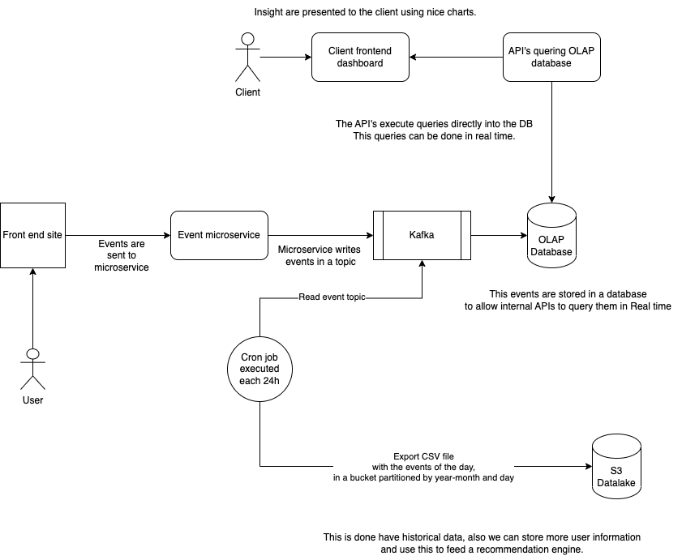

# Job Marketplace

# Events ingestion




## User view job detail page

This event is fired when the user landas into the job detail page, with the data collected it is possible to collect the following insights:

- Percentajes of visits to the job offer coming from search-engine, search-page, link-referal or email-campaign.
- Average of time spend by the user reading the job offer, before either procced to apply or be idle.
-

```sh

    {
        userId: string (nullable),
        jobId: string,
        is_user_authenticated: boolean,
        event_timestamp: timestamp,
        active_time_in_page_in_seconds: number,
        previous_page: string ('search-engine', 'search-page', 'link-referral', 'email-campaigns')
        platform: string (web/ios/android)
    }

```

## Filters section activity: 

This events collect the user behaviour in the filter section, with this data is possible to know:

- Average time of the user filtering before finding a list of meaningful jobs.
- Number of filters applied before finding a list of meaningful jobs.

```sh

    {
        userId: string (nullable),
        is_user_authenticated: boolean,
        event_timestamp: timestamp,
        active_time_in_filter_section_in_seconds: number,
        number_of_applied_filters: number,
        platform: string (web/ios/android)
    }

```

## Applied filter:

This events register when a particular filter with an specific value is applied, with this is possible to know if the filters are meaningful or not.

```sh

    {
        userId: string (nullable),
        is_user_authenticated: boolean,
        event_timestamp: timestamp,
        filter_name: string,
        filter_values: [string],
        platform: string (web/ios/android)
    }

```

## Job details section activity:

This events will record the amount of time spend in each of the sections of the page, the assumption is done based on scroll and mouse activity. With this is possible to know:

- Avg time spend in each section

```sh

    {
        userId: string (nullable),
        offerId: string,
        is_user_authenticated: boolean,
        event_timestamp: timestamp,
        section: string, (headline, qualifications, apply-section)
        avg_time_per_section_in_seconds: number,
        platform: string (web/ios/android)
    }

```
